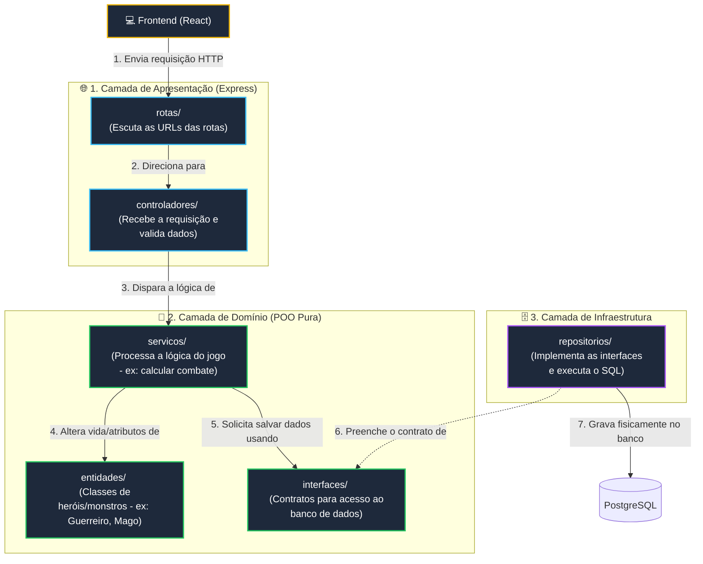

# Estrutura do Backend (Arquitetura em Camadas)

Este documento detalha a organização do código-fonte do backend do projeto **Fracture: The Vaslen Echoes**, explicando a responsabilidade de cada pasta e como a Programação Orientada a Objetos (POO) é aplicada para manter o sistema limpo, testável e desacoplado.

---

## 🎨 Exemplo Visual: Fluxo de Dependências

O fluxo de dados segue a regra de dependência de fora para dentro. A camada interna (Domínio) **nunca** conhece as camadas externas (Apresentação e Infraestrutura).



---

## 📂 Organização das Pastas e Objetivos

```
projeto-game/
├── backend/                # Código-fonte do Backend (Node.js + TS)
│   ├── src/
│   │   ├── configuracoes/  # Configurações do servidor e conexões
│   │   ├── dominio/        # Lógica central e regras de negócio do jogo (Sem frameworks)
│   │   │   ├── entidades/  # Classes principais de personagens e monstros
│   │   │   ├── interfaces/ # Contratos e assinaturas de métodos
│   │   │   └── servicos/   # Lógica ativa de ações (combates, xp, login)
│   │   ├── infraestrutura/ # Contato com o banco de dados e bibliotecas externas
│   │   │   ├── repositorios/ # Persistência de dados física no PostgreSQL
│   │   │   └── seguranca/  # Hashes de senhas e geração de tokens
│   │   ├── apresentacao/   # Servidor HTTP Express e endpoints da API
│   │   │   ├── controladores/ # Classes que recebem as requisições HTTP
│   │   │   ├── middlewares/ # Intermediários de validações e segurança
│   │   │   └── rotas/      # Mapeamento de endpoints do Express
│   │   ├── aplicativo.ts   # Configuração e inicialização da classe Aplicativo
│   │   └── servidor.ts     # Arquivo que roda o servidor Node.js
│   └── testes/             # Testes unitários do jogo
│
├── frontend/               # Código-fonte do Frontend (React + TS)
│
├── config_docs/            # Pasta mãe de especificações e documentação
│   ├── brain/              # Regras e contextos (contexto.md, funcionalidades.md)
│   ├── entregas/           # Documentos formais de entregas (Sprints)
│   └── testes/             # Testes experimentais e mocks (ex: sprite_player.html)
│
└── AGENTS.md               # Diretrizes e regras obrigatórias da IA (Antigravity)
```

---

## 🛡️ Detalhamento das Pastas (Objetivos)

### 1. `src/dominio/` (Core do Jogo)
Esta pasta contém a essência do RPG. Ela é isolada: não possui código do Express, SQL ou conexões HTTP. É POO puríssima.
*   **`entidades/`**: Contém as classes que modelam o jogo. Exemplo:
    *   `EntidadeCombatente.ts` (Classe Abstrata contendo atributos privados como `#vida`, `#forca`, `#defesa`, `#agilidade` e métodos como `receberDano()`).
    *   `Guerreiro.ts`, `Mago.ts` (Classes herdeiras que aplicam o polimorfismo em golpes específicos).
*   **`interfaces/`**: Contém contratos de persistência. Exemplo:
    *   `IRepositorioPersonagem.ts` (Interface TypeScript que define os métodos que o banco de dados deve ter, como `salvar(personagem)` ou `inativar(id)`).
*   **`servicos/`**: Contém lógicas que envolvem interações entre entidades. Exemplo:
    *   `CalculadoraCombate.ts` (Lógica que calcula turnos de batalha com base na agilidade e processa danos físicos/mágicos).

### 2. `src/infraestrutura/` (Implementações Técnicas)
Implementa as soluções tecnológicas que suportam o domínio.
*   **`repositorios/`**: Contém a classe que de fato executa comandos SQL ou usa o ORM para conversar com o PostgreSQL.
    *   `RepositorioPersonagemPostgres.ts` (Classe concreta que implementa a interface `IRepositorioPersonagem` e executa as queries físicas no banco).
*   **`seguranca/`**: Lógicas acessórias que usam pacotes do npm.
    *   `CriptografiaBcrypt.ts` (Criptografa senhas e valida logins).

### 3. `src/apresentacao/` (Entrada e HTTP)
Responsável por expor a lógica do jogo na Web utilizando o framework Express.
*   **`controladores/`**: Recebe requisições HTTP, valida o formato dos dados e envia para os serviços de domínio.
    *   `ControladorLobby.ts` (Classe com métodos como `criarPersonagem` e `inativarPersonagem` que retornam JSON).
*   **`middlewares/`**: Interceptadores que validam se o jogador está logado.
*   **`rotas/`**: Configura os endpoints que o frontend React vai chamar (ex: `router.post('/personagens', controlador.criar)`).

### 4. `src/configuracoes/`
Variáveis de ambiente (.env), portas do servidor e conexões do pool de conexão do PostgreSQL.

---

## 💡 Por que essa estrutura é benéfica para a nota de POO?
*   **Facilidade de Substituição**: Se o professor pedir para trocar o banco de dados PostgreSQL por arquivos locais `.json`, alteramos apenas a pasta `infraestrutura/repositorios` criando o `RepositorioPersonagemJSON.ts` que implementa a mesma interface. A lógica do combate no `dominio` continua intocada.
*   **Responsabilidade Única (SRP)**: Cada pasta tem apenas uma função muito bem delineada, evitando classes gigantescas com lógica misturada.
