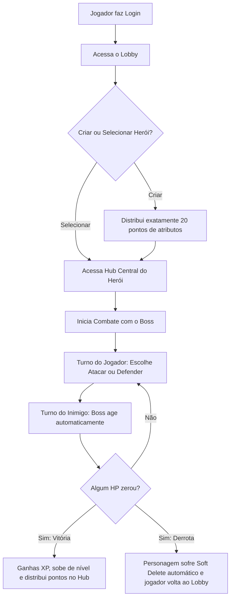
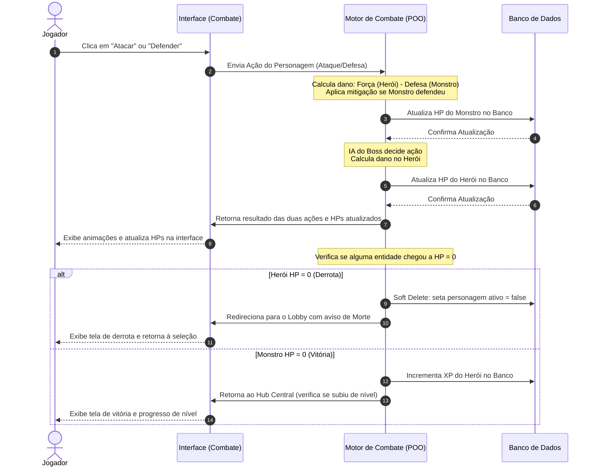

# Fracture: The Vaslen Echoes — Documento Consolidado de Entregas

Este documento reúne de forma contínua e consolidada todas as atividades e entregas de desenvolvimento do sistema web **Fracture: The Vaslen Echoes** para a disciplina de Programação Orientada a Objetos (POO).

---

# Atividade 1 — Descrição do Projeto

### Nome do Sistema
**Fracture: The Vaslen Echoes**

### Área de Atuação
Desenvolvimento de Software, Jogos Digitais e Aplicações Web Interativas.

---

### Descrição do Problema
O ensino e aprendizado prático de Programação Orientada a Objetos (POO) em nível universitário costuma ser pautado em sistemas de informação administrativos tradicionais, como controle de vendas, cadastros de clientes ou gestão de frotas. Embora úteis, esses temas falham em ilustrar de forma orgânica e empolgante o uso de mecânicas de estado em tempo real e comportamentos polimórficos ricos. 

Além disso, há uma escassez de exemplos práticos que integrem de forma harmônica a orientação a objetos robusta com tecnologias web e persistência em banco de dados, sem cair na simplicidade de operações de CRUD básicas (criação, leitura, atualização e exclusão sem regras de domínio significativas).

### Descrição da Solução Proposta
A solução consiste no desenvolvimento de um jogo de RPG de batalhas por turnos baseado em navegador (Web App) com estética de fantasia medieval sombria. O jogo utiliza os pilares de POO para gerenciar a lógica complexa de combate e estados. 

As entidades do jogo (heróis, classes, monstros, chefes e efeitos de status) são modeladas utilizando conceitos de **Herança e Polimorfismo**. As fórmulas matemáticas de combate e modificadores de atributos são protegidos através de **Encapsulamento**, e as regras de negócio de morte do personagem são integradas diretamente à persistência do banco de dados, implementando exclusão lógica (**Soft Delete**) de forma a agregar consequências reais e permanência à jogabilidade.

### Público-alvo
*   Estudantes e entusiastas de engenharia de software e programação orientada a objetos interessados em modelagem de domínio rica.
*   Jogadores casuais de RPGs táticos e jogos de combate por turnos que apreciam desafios estratégicos e ambientação medieval sombria.

### Objetivo Geral do Sistema
Prover uma plataforma web dinâmica, interativa e envolvente na qual os jogadores criem personagens, distribuam atributos estrategicamente, enfrentem criaturas e chefes em combate tático por turnos, evoluam seu nível através do acúmulo de experiência, enquanto experimentam as consequências definitivas de suas ações (morte permanente regulada por banco de dados).

---

### Principais Funcionalidades
1.  **Autenticação de Usuários**: Cadastro de conta, login seguro e controle de acesso a rotas protegidas.
2.  **Lobby de Personagens**: Exibição dos personagens ativos da conta e opção de desativação manual (Soft Delete).
3.  **Criação Personalizada**: Sistema de criação de personagens com escolha de classe e validação matemática obrigatória de exatamente 20 pontos de atributos iniciais para evitar trapaças.
4.  **Hub Central e Evolução**: Exibição detalhada de status, evolução de nível do herói com redistribuição de novos pontos de atributos permanentes.
5.  **Códice de Vaslen**: Interface de pesquisa textual ligada ao banco de dados contendo o lore do reino, regras de combate e informações sobre monstros e chefes.
6.  **Motor de Combate por Turnos**: Sistema de batalha em tempo real simulado no navegador entre o herói e um chefe, com cálculo matemático de dano (ataque/defesa).
7.  **Consequência de Morte**: Sistema automatizado de derrota que inativa de forma permanente o personagem no banco de dados após sua vida chegar a zero.

---

### Descrição do Processo Principal
O processo de jogo segue o seguinte fluxo linear:

1.  **Acesso**: O jogador realiza o login ou cadastro para acessar a lista de personagens ativos da sua conta.
2.  **Criação/Seleção**: O jogador seleciona um personagem existente ou cria um novo, distribuindo obrigatoriamente 20 pontos iniciais em seus atributos.
3.  **Combate**: O jogador entra no painel de combate contra um monstro/chefe medieval. 
4.  **Duelo de Turnos**: No seu turno, o jogador escolhe uma ação (ex: atacar ou defender). O sistema calcula o impacto de dano baseado nos atributos do personagem. No turno do sistema, a inteligência do monstro responde atacando o jogador.
5.  **Desfecho**:
    *   **Vitória**: Se o HP do chefe chegar a zero primeiro, o herói recebe XP. Caso suba de nível, ele pode distribuir pontos extras no Hub Central.
    *   **Derrota**: Se o HP do herói zerar, ocorre a **derrota definitiva**. O sistema altera o status do personagem no banco de dados para inativo (Soft Delete). O herói é "apagado" da lista de seleção do jogador, restando ao usuário criar ou selecionar outro personagem no Lobby.

---

### Justificativa para a Escolha do Tema
A escolha de um RPG medieval de batalhas por turnos se justifica pela perfeita aderência entre a temática do jogo e os requisitos pedagógicos e técnicos da disciplina de Programação Orientada a Objetos. 

Em sistemas web tradicionais, o comportamento polimórfico costuma se limitar a pequenos detalhes, enquanto em um RPG de combate, heróis e monstros possuem comportamentos e reações radicalmente diferentes que se beneficiam diretamente de classes abstratas e interfaces de combate. Além disso, a aplicação de regras matemáticas restritas na criação e a mecânica de morte permanente (Soft Delete) demonstram a robustez necessária na integração entre o back-end, banco de dados e a experiência final no front-end web.

---

# Atividade 2 — Levantamento dos Requisitos

## Perfis de Usuário e Permissões

O sistema possui dois perfis distintos de usuários autenticados para garantir o acesso adequado às funcionalidades:

### 1. Jogador (Player)
Perfil padrão destinado aos usuários que interagem com a jogabilidade e progressão.
*   **Permissões**:
    *   Cadastrar conta e realizar login/logout.
    *   Criar personagens vinculados à sua conta (distribuindo atributos iniciais).
    *   Visualizar e selecionar personagens ativos em seu Lobby.
    *   Inativar manualmente seus personagens (Soft Delete).
    *   Iniciar combates, realizar ações (atacar/defender) no motor de batalha por turnos.
    *   Evoluir personagens distribuindo novos pontos de atributos após subir de nível.
    *   Consultar termos, regras e monstros cadastrados no Códice de Vaslen.

### 2. Administrador (Admin)
Perfil com acesso irrestrito ao painel de controle, manutenção e balanceamento do jogo.
*   **Permissões**:
    *   Todas as permissões do perfil de Jogador.
    *   Gerenciar o Códice de Vaslen (criar, editar e remover termos de lore, guias e monstros).
    *   Cadastrar, configurar e balancear novos monstros/chefes do jogo (HP, Força, Defesa, Agilidade).
    *   Acessar relatórios e logs simples do sistema (ex: total de contas criadas, personagens ativos/deletados).

---

## Requisitos Funcionais (RF)

| Código | Requisito | Descrição |
| :--- | :--- | :--- |
| **RF01** | Cadastro de Contas | O sistema deve permitir que novos usuários criem contas informando e-mail e senha. |
| **RF02** | Autenticação (Login) | O sistema deve permitir a autenticação do usuário e assegurar que rotas internas do jogo exijam uma sessão válida. |
| **RF03** | Criação de Personagens | O sistema deve permitir ao Jogador criar novos personagens escolhendo um nome e uma classe (ex: Guerreiro, Mago, Arqueiro). |
| **RF04** | Validação de Atributos | O sistema deve validar no servidor que a soma dos atributos iniciais (Força, Defesa e Agilidade) seja exatamente igual a 20. |
| **RF05** | Lobby de Seleção | O sistema deve exibir para o Jogador autenticado a lista de seus personagens que estão ativos no banco de dados. |
| **RF06** | Inativação Manual | O sistema deve permitir ao Jogador desativar manualmente qualquer personagem (Soft Delete), removendo-o da listagem do Lobby. |
| **RF07** | Motor de Combate (Turnos) | O sistema deve gerenciar uma batalha sequencial de turnos entre o personagem do jogador e o monstro/chefe selecionado. |
| **RF08** | Ação do Jogador | O sistema deve permitir que o Jogador execute ações no seu turno, como "Atacar" ou "Defender". |
| **RF09** | Processamento do Inimigo | O sistema deve processar a ação automatizada do Chefe (IA do Boss) imediatamente após o encerramento do turno do jogador. |
| **RF10** | Evolução de Nível (XP) | O sistema deve conceder experiência (XP) ao personagem sobrevivente após uma vitória e habilitar a redistribuição/soma de novos atributos no Hub Central. |
| **RF11** | Derrota e Soft Delete | O sistema deve inativar permanentemente no banco de dados (Soft Delete) o personagem cuja vida (HP) for reduzida a zero no combate. |
| **RF12** | Códice de Lore | O sistema deve fornecer uma barra de pesquisa textual com filtros para consulta aos termos de lore, inimigos e mecânicas gravadas no Códice. |
| **RF13** | Painel do Administrador | O sistema deve fornecer uma interface exclusiva para o Administrador cadastrar monstros e modificar dados do Códice de Lore. |

---

## Requisitos Não Funcionais (RNF)

| Código | Requisito | Descrição |
| :--- | :--- | :--- |
| **RNF01** | Responsividade | A interface web do sistema deve ser responsiva, permitindo usabilidade fluida tanto em computadores (desktops) quanto em celulares e tablets. |
| **RNF02** | Segurança de Senhas | O sistema deve armazenar as senhas dos usuários criptografadas no banco de dados utilizando algoritmos hash seguros (como bcrypt). |
| **RNF03** | Tempo de Resposta | O tempo médio de processamento e persistência das ações de combate (ataques, defesas e fim de turno) não deve ultrapassar 500 milissegundos. |
| **RNF04** | Portabilidade de Navegador | O sistema deve ser compatível e renderizar de forma consistente em todos os navegadores modernos (Edge, Chrome, Firefox, Safari). |
| **RNF05** | Persistência de Estado | O sistema deve assegurar a integridade do estado da batalha, registrando o progresso do turno para evitar perdas de dados em caso de desconexão. |

---

## Regras de Negócio (RN)

| Código | Regra | Descrição |
| :--- | :--- | :--- |
| **RN01** | Distribuição Obrigatória de Pontos | A soma dos atributos de criação (`Força + Defesa + Agilidade`) deve totalizar **exatamente 20 pontos** iniciais. Qualquer valor menor ou maior deve ser rejeitado no back-end. |
| **RN02** | Atributos Mínimos | Nenhum atributo de personagem ou monstro (HP, Força, Defesa, Agilidade) poderá conter valor negativo ou igual a zero (com exceção do HP atual durante a batalha). |
| **RN03** | Inativação Automática (Morte) | Quando o HP do personagem chegar a zero durante a batalha, o sistema deve marcar o atributo `ativo` do registro no banco de dados como `false` (Soft Delete). |
| **RN04** | Acesso a Personagens Inativos | Registros de personagens com `ativo = false` não podem ser listados no Lobby de seleção nem ter seu estado alterado de volta para ativo. |
| **RN05** | Fórmula de Dano Mínimo | O dano físico infligido no ataque é calculado como `Dano = Força (Atacante) - Defesa (Defensor)`. Se a Defesa for igual ou superior à Força, o dano mínimo aplicado será sempre de **1 ponto** para evitar combates infinitos. |
| **RN06** | Iniciativa de Turno | A iniciativa do primeiro turno do combate é dada à entidade (herói ou monstro) que possuir o maior atributo de `Agilidade`. Em caso de empate, o jogador tem a preferência. |
| **RN07** | Escalonamento de Experiência (XP) | O limite de experiência para subir de nível é calculado de forma progressiva pela fórmula `XP_Necessário = Nível_Atual * 100`. |
| **RN08** | Restrição de Acesso Administrativo | As rotas de criação de monstros e alteração de termos do Códice de Lore devem ser validadas no back-end, permitindo acesso exclusivo a usuários marcados com perfil `ADMIN`. |
| **RN09** | Confirmação de Level Up | O personagem que subir de nível ficará com status "pendente de evolução", impedindo-o de entrar em novos combates até que o jogador distribua os novos pontos de atributos no Hub Central. |

---

## Descrição Detalhada do Processo Principal

O processo principal de **Fracture: The Vaslen Echoes** consiste no **Ciclo de Combate por Turnos e Suas Consequências**. Este fluxo interage ativamente com os pilares da Orientação a Objetos.

### Diagrama de Sequência de Combate

---

# Atividade 3 — Identificação das Classes

Nesta etapa são identificadas e modeladas as principais classes que compõem o domínio de **Fracture: The Vaslen Echoes**. Cada classe foi projetada com base nos princípios de **Abstração**, **Encapsulamento**, **Herança** e **Polimorfismo**, respeitando a convenção de nomenclatura em **Português do Brasil (PT-BR)**.

---

### Conceitos Relacionados à Modelagem
*   **Abstração**: Separação das características essenciais das entidades do jogo (como pontos de vida e combate) dos detalhes técnicos de infraestrutura ou renderização.
*   **Classe**: Molde/estrutura que define os atributos e comportamentos de uma entidade (ex: a classe `Personagem`).
*   **Objeto / Instância**: A materialização concreta de uma classe na memória durante a execução (ex: um guerreiro específico chamado "Kael", que é uma instância da classe `Personagem`).
*   **Atributos**: As variáveis que armazenam o estado interno do objeto (ex: `vidaAtual`, `forca`).
*   **Métodos**: As funções/ações que manipulam o estado interno e definem o comportamento do objeto (ex: `atacar()`, `receberDano()`).

---

## Detalhamento das Classes do Domínio

### 1. Classe `Usuario`
*   **Finalidade**: Representar a conta de acesso e identidade do usuário autenticado no sistema.
*   **Responsabilidade**: Gerenciar os dados cadastrais, credenciais de acesso, perfil de permissão (Jogador ou Administrador) e a coleção de personagens criados vinculados à sua conta.
*   **Atributos**:
    *   `id`: Identificador único da conta.
    *   `email`: Endereço de e-mail utilizado para login.
    *   `senhaHash`: Hash criptográfico da senha de acesso.
    *   `tipoUsuario`: Perfil do usuário (`JOGADOR` ou `ADMINISTRADOR`).
    *   `dataCriacao`: Data e hora em que a conta foi criada.
    *   `personagens`: Lista contendo os objetos do tipo `Personagem` associados a esta conta.
*   **Métodos**:
    *   `autenticar(senhaInformada)`: Verifica se a senha informada corresponde ao hash cadastrado.
    *   `alterarSenha(senhaAtual, novaSenha)`: Valida e atualiza a senha de acesso do usuário.
    *   `adicionarPersonagem(personagem)`: Vincula um novo personagem criado à conta.
    *   `inativarPersonagem(idPersonagem)`: Executa a inativação lógica (Soft Delete) de um personagem da lista.
    *   `listarPersonagensAtivos()`: Retorna apenas os personagens com status ativo pertencentes ao usuário.
    *   `ehAdministrador()`: Retorna um booleano indicando se o perfil possui privilégios de administrador.

---

### 2. Classe Abstrata `EntidadeCombatente`
*   **Finalidade**: Servir como classe base abstrata para todos os seres capazes de batalhar no jogo (personagens dos jogadores e monstros).
*   **Responsabilidade**: Encapsular os atributos vitais e de combate fundamentais, fornecendo métodos universais para recebimento de dano, recuperação de vida e verificação de sobrevivência.
*   **Atributos**:
    *   `id`: Identificador único da entidade.
    *   `nome`: Nome da entidade.
    *   `nivel`: Nível atual de poder da entidade.
    *   `vidaMaxima`: Quantidade máxima de pontos de vida (HP).
    *   `vidaAtual`: Quantidade atual de pontos de vida durante o combate.
    *   `forca`: Atributo que determina o poder de ataque físico.
    *   `defesa`: Atributo que determina a mitigação de dano recebido.
    *   `agilidade`: Atributo que determina a iniciativa nos turnos e chance de esquiva.
    *   `estaDefendendo`: Indicador booleano de postura defensiva no turno atual.
*   **Métodos**:
    *   `atacar(alvo)`: Executa um ataque básico contra uma entidade alvo.
    *   `defender()`: Ativa a postura de defesa para mitigar dano no próximo golpe recebido.
    *   `receberDano(valorDano)`: Deduz pontos de vida com base no dano líquido calculado, garantindo que a vida não fique negativa.
    *   `curarVida(quantidade)`: Restaura pontos de vida respeitando o limite de `vidaMaxima`.
    *   `estaDerrotado()`: Retorna verdadeiro se a `vidaAtual` for igual a 0.
    *   `calcularIniciativa()`: Retorna o valor de agilidade para desempate de ordem de ação.
    *   `executarAcaoEspecial(alvo)`: Método abstrato que obriga cada subclasse a implementar sua habilidade única (Polimorfismo).

---

### 3. Classe `Personagem` (Herda de `EntidadeCombatente`)
*   **Finalidade**: Representar o herói criado e controlado pelo jogador dentro do RPG.
*   **Responsabilidade**: Controlar a classe do herói, a progressão de experiência (XP), o ganho de níveis, a distribuição de atributos e o estado ativo no banco de dados.
*   **Atributos**:
    *   *(Herda todos os atributos de `EntidadeCombatente`)*
    *   `classeHeroi`: Especialização do herói (`GUERREIRO`, `MAGO`, `ARQUEIRO`).
    *   `experienciaAtual`: Quantidade de pontos de experiência acumulados.
    *   `experienciaNecessaria`: Total de XP necessário para alcançar o próximo nível.
    *   `pontosLivres`: Pontos de atributo disponíveis para distribuição após subir de nível.
    *   `ativo`: Indicador booleano que define se o personagem está ativo ou foi inativado (Soft Delete).
    *   `idUsuario`: Chave estrangeira que referencia a conta dona do personagem.
*   **Métodos**:
    *   *(Herda os métodos de `EntidadeCombatente`)*
    *   `validarDistribuicaoInicial(forca, defesa, agilidade)`: Valida se a soma dos atributos iniciais totaliza exatamente 20 pontos.
    *   `ganharExperiencia(quantidade)`: Adiciona XP e dispara a verificação de subida de nível.
    *   `verificarSubidaNivel()`: Avalia se a `experienciaAtual` atingiu `experienciaNecessaria`.
    *   `subirNivel()`: Incrementa o nível, recalcula a vida máxima e concede novos pontos livres.
    *   `distribuirPontos(forcaAdd, defesaAdd, agilidadeAdd)`: Adiciona os pontos distribuídos aos atributos permanentes do personagem.
    *   `marcarComoDerrotado()`: Inativa o personagem alterando `ativo` para `false` (Soft Delete).
    *   `executarAcaoEspecial(alvo)`: Sobrescrita polimórfica que executa a habilidade característica da classe do herói (ex: *Golpe Pesado* para Guerreiro, *Bola de Fogo* para Mago).

---

### 4. Classe `Monstro` (Herda de `EntidadeCombatente`)
*   **Finalidade**: Representar os inimigos e chefes (Bosses) do reino de Vaslen enfrentados pelo jogador.
*   **Responsabilidade**: Definir o padrão de inteligência artificial simples (escolha de ataques), a recompensa de experiência concedida e as descrições de lore.
*   **Atributos**:
    *   *(Herda todos os atributos de `EntidadeCombatente`)*
    *   `tipoMonstro`: Categoria da criatura (`COMUM`, `ELITE`, `CHEFE`).
    *   `experienciaConcedida`: Quantidade de XP concedida ao jogador caso o monstro seja derrotado.
    *   `padraoComportamento`: Estratégia de IA utilizada para escolher as ações da criatura a cada turno.
    *   `descricaoLore`: Texto descritivo sobre as origens e fraquezas da criatura.
*   **Métodos**:
    *   *(Herda os métodos de `EntidadeCombatente`)*
    *   `decidirAcao(alvo)`: Algoritmo de IA que analisa o estado da batalha e decide entre ataque básico, defesa ou habilidade de chefe.
    *   `obterRecompensaXP()`: Retorna a quantidade de XP a ser transferida para o jogador vitorioso.
    *   `executarAcaoEspecial(alvo)`: Sobrescrita polimórfica que executa o golpe devastador característico do chefe (ex: *Rugido Corruptor* do Lich).

---

### 5. Classe `MotorCombate`
*   **Finalidade**: Orquestrar a execução, o estado e as rodadas de uma batalha entre um `Personagem` e um `Monstro`.
*   **Responsabilidade**: Controlar o ciclo de turnos, determinar a ordem de ataque pela iniciativa, invocar o cálculo de danos e declarar o encerramento da batalha com vitória ou derrota.
*   **Atributos**:
    *   `idBatalha`: Identificador único do combate em andamento.
    *   `personagem`: Instância do herói participante.
    *   `monstro`: Instância do monstro adversário.
    *   `numeroTurno`: Contador sequencial do número de rodadas da batalha.
    *   `turnoAtual`: Identifica de quem é a vez de jogar (`TURNO_JOGADOR` ou `TURNO_MONSTRO`).
    *   `estadoCombate`: Estado atual da luta (`EM_ANDAMENTO`, `VITORIA_JOGADOR`, `DERROTA_JOGADOR`).
    *   `historicoEventos`: Lista de mensagens textuais narrando cada ação ocorrida no combate.
*   **Métodos**:
    *   `iniciarCombate()`: Configura os combatentes e determina quem age primeiro com base na agilidade.
    *   `processarTurnoJogador(tipoAcao)`: Executa a ação escolhida pelo jogador (atacar/defender/especial) e aplica os efeitos no monstro.
    *   `processarTurnoMonstro()`: Invoca a IA do monstro para executar sua ação contra o herói.
    *   `verificarFimCombate()`: Avalia se o HP de algum dos participantes zerou.
    *   `finalizarVitoria()`: Concede o XP do monstro ao personagem e encerra a sessão de combate.
    *   `finalizarDerrota()`: Aciona a inativação permanente (Soft Delete) do herói derrotado.
    *   `obterResumoEstado()`: Retorna o estado completo atualizado para sincronização com a interface.

---

### 6. Classe `CalculadoraCombate`
*   **Finalidade**: Centralizar todas as fórmulas matemáticas, modificadores e regras de balanceamento de dano do jogo.
*   **Responsabilidade**: Isolar a matemática de combate das classes de entidade, garantindo baixo acoplamento e facilidade de ajuste das regras de domínio.
*   **Atributos**:
    *   `danoMinimoGarantido`: Valor mínimo de dano aplicado em qualquer ataque (padrão: 1 ponto).
    *   `multiplicadorDefesa`: Fator de mitigação aplicado quando a entidade está em postura defensiva.
*   **Métodos**:
    *   `calcularDanoFisico(forcaAtacante, defesaDefensor, estaDefendendo)`: Aplica a fórmula `Força - Defesa` considerando o dano mínimo de 1 e o fator de postura de defesa.
    *   `calcularDanoEspecial(forcaAtacante, modificadorClasse, defesaDefensor)`: Calcula o impacto de habilidades especiais e mágicas.
    *   `calcularChanceEsquiva(agilidadeAtacante, agilidadeDefensor)`: Avalia se o golpe foi totalmente evadido com base na diferença de agilidade.

---

### 7. Classe `EntradaCodice`
*   **Finalidade**: Representar um verbete ou registro enciclopédico consultável no Códice de Vaslen.
*   **Responsabilidade**: Armazenar informações sobre o universo do jogo, criaturas, chefes e regras de batalha, viabilizando buscas textuais e categorizadas.
*   **Atributos**:
    *   `id`: Identificador único da entrada do códice.
    *   `titulo`: Título ou nome do assunto (ex: "O Lich de Vaslen", "Regras de Iniciativa").
    *   `categoria`: Categoria temática (`MONSTRO`, `LORE`, `REGRA_COMBATE`, `CLASSE`).
    *   `conteudo`: Texto descritivo e explicativo detalhado sobre o verbete.
    *   `dataCadastro`: Data de registro no sistema.
    *   `idAutorAdmin`: Identificador do administrador que cadastrou ou editou o verbete.
*   **Métodos**:
    *   `atualizarVerbete(novoTitulo, novoConteudo, novaCategoria)`: Permite a modificação dos dados por um administrador.
    *   `contemTermo(termoBusca)`: Realiza a checagem textual se a palavra-chave pesquisada existe no título ou no conteúdo.
    *   `formatarParaCard()`: Retorna uma estrutura resumida formatada para apresentação na interface web do jogador.

---

## Resumo das Classes e Relações de POO

| Classe | Tipo | Herança / Associação | Pilar Principal de POO Destacado |
| :--- | :--- | :--- | :--- |
| **`Usuario`** | Concreta | Contém múltiplos `Personagem` | **Encapsulamento** (controle seguro de credenciais e coleção) |
| **`EntidadeCombatente`** | Abstrata | Classe mãe de `Personagem` e `Monstro` | **Abstração & Herança** (reutilização de atributos vitais e métodos base) |
| **`Personagem`** | Concreta | Herda de `EntidadeCombatente` | **Polimorfismo & Herança** (implementa habilidades de herói e progressão de XP) |
| **`Monstro`** | Concreta | Herda de `EntidadeCombatente` | **Polimorfismo & Herança** (implementa IA de monstro e habilidades de chefe) |
| **`MotorCombate`** | Concreta | Associa `Personagem` e `Monstro` | **Abstração & Identificação de Responsabilidades** (orquestração de turnos) |
| **`CalculadoraCombate`** | Concreta | Serviço de cálculo utilizado pelo motor | **Encapsulamento** (isolamento das fórmulas matemáticas de dano) |
| **`EntradaCodice`** | Concreta | Entidade independente associada a `Usuario` (Admin) | **Abstração** (representação de registros textuais dinâmicos do lore) |
