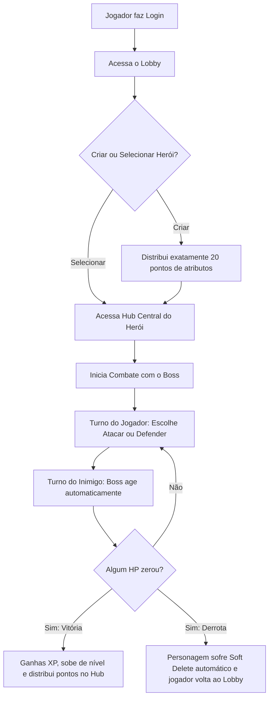

# Sprint 1: Descrição do Projeto - Fracture: The Vaslen Echoes

Este documento formaliza a proposta de projeto de desenvolvimento de software para a disciplina de Programação Orientada a Objetos (POO). Ele define as diretrizes gerais, o problema a ser resolvido, a solução proposta e as regras fundamentais do jogo.

---

### Nome do Sistema
**Fracture: The Vaslen Echoes**

### Área de Atuação
Desenvolvimento de Software, Jogos Digitais e Aplicações Web Interativas.

---

### Descrição do Problema
O ensino e aprendizado prático de Programação Orientada a Objetos (POO) em nível universitário costuma ser pautado em sistemas de informação administrativos tradicionais, como controle de vendas, cadastros de clientes ou gestão de frotas. Embora úteis, esses temas falham em ilustrar de forma orgânica e empolgante o uso de mecânicas de estado em tempo real e comportamentos polimórficos ricos. 

Além disso, há uma escassez de exemplos práticos que integrem de forma harmônica a orientação a objetos robusta com tecnologias web e persistência em banco de dados, sem cair na simplicidade de operações de CRUD básicas (criação, leitura, atualização e exclusão sem regras de domínio significativas).

### Descrição da Solução Proposta
A solução consiste no desenvolvimento de um jogo de RPG de batalhas por turnos baseado em navegador (Web App) com estética de fantasia medieval sombria. O jogo utiliza os pilares de POO para gerenciar a lógica complexa de combate e estados. 

As entidades do jogo (heróis, classes, monstros, chefes e efeitos de status) serão modeladas utilizando conceitos de **Herança e Polimorfismo**. As fórmulas matemáticas de combate e modificadores de atributos serão protegidos através de **Encapsulamento**, e as regras de negócio de morte do personagem serão integradas diretamente à persistência do banco de dados, implementando exclusão lógica (**Soft Delete**) de forma a agregar consequências reais e permanência à jogabilidade.

### Público-alvo
*   Estudantes e entusiastas de engenharia de software e programação orientada a objetos interessados em modelagem de domínio rica.
*   Jogadores casuais de RPGs táticos e jogos de combate por turnos que apreciam desafios estratégicos e ambientação medieval sombria.

### Objetivo Geral do Sistema
Prover uma plataforma web dinâmica, interativa e envolvente na qual os jogadores criem personagens, distribuam atributos estrategicamente, enfrentem criaturas e chefes em combate tático por turnos, evoluam seu nível através do acúmulo de experiência, enquanto experimentam as consequências definitivas de suas ações (morte permanente regulada por banco de dados).

---

### Principais Funcionalidades
1.  **Autenticação de Usuários**: Cadastro de conta, login seguro e controle de acesso a rotas protegidas.
2.  **Lobby de Personagens**: Exibição dos personagens ativos da conta e opção de desativação manual (Soft Delete).
3.  **Criação Personalizada**: Sistema de criação de personagens com escolha de classe e validação matemática obrigatória de exatamente 20 pontos de atributos iniciais para evitar trapaças.
4.  **Hub Central e Evolução**: Exibição detalhada de status, evolução de nível do herói com redistribuição de novos pontos de atributos permanentes.
5.  **Códice de Vaslen**: Interface de pesquisa textual ligada ao banco de dados contendo o lore do reino, regras de combate e informações sobre monstros e chefes.
6.  **Motor de Combate por Turnos**: Sistema de batalha em tempo real simulado no navegador entre o herói e um chefe, com cálculo matemático de dano (ataque/defesa).
7.  **Consequência de Morte**: Sistema automatizado de derrota que inativa de forma permanente o personagem no banco de dados após sua vida chegar a zero.

---

### Descrição do Processo Principal
O processo de jogo segue o seguinte fluxo linear:

1.  **Acesso**: O jogador realiza o login ou cadastro para acessar a lista de personagens ativos da sua conta.
2.  **Criação/Seleção**: O jogador seleciona um personagem existente ou cria um novo, distribuindo obrigatoriamente 20 pontos iniciais em seus atributos.
3.  **Combate**: O jogador entra no painel de combate contra um monstro/chefe medieval. 
4.  **Duelo de Turnos**: No seu turno, o jogador escolhe uma ação (ex: atacar ou defender). O sistema calcula o impacto de dano baseado nos atributos do personagem. No turno do sistema, a inteligência do monstro responde atacando o jogador.
5.  **Desfecho**:
    *   **Vitória**: Se o HP do chefe chegar a zero primeiro, o herói recebe XP. Caso suba de nível, ele pode distribuir pontos extras no Hub Central.
    *   **Derrota**: Se o HP do herói zerar, ocorre a **derrota definitiva**. O sistema altera o status do personagem no banco de dados para inativo (Soft Delete). O herói é "apagado" da lista de seleção do jogador, restando ao usuário criar ou selecionar outro personagem no Lobby.

---

### Justificativa para a Escolha do Tema
A escolha de um RPG medieval de batalhas por turnos se justifica pela perfeita aderência entre a temática do jogo e os requisitos pedagógicos e técnicos da disciplina de Programação Orientada a Objetos. 

Em sistemas web tradicionais, o comportamento polimórfico costuma se limitar a pequenos detalhes, enquanto em um RPG de combate, heróis e monstros possuem comportamentos e reações radicalmente diferentes que se beneficiam diretamente de classes abstratas e interfaces de combate. Além disso, a aplicação de regras matemáticas restritas na criação e a mecânica de morte permanente (Soft Delete) demonstram a robustez necessária na integração entre o back-end, banco de dados e a experiência final no front-end web.
