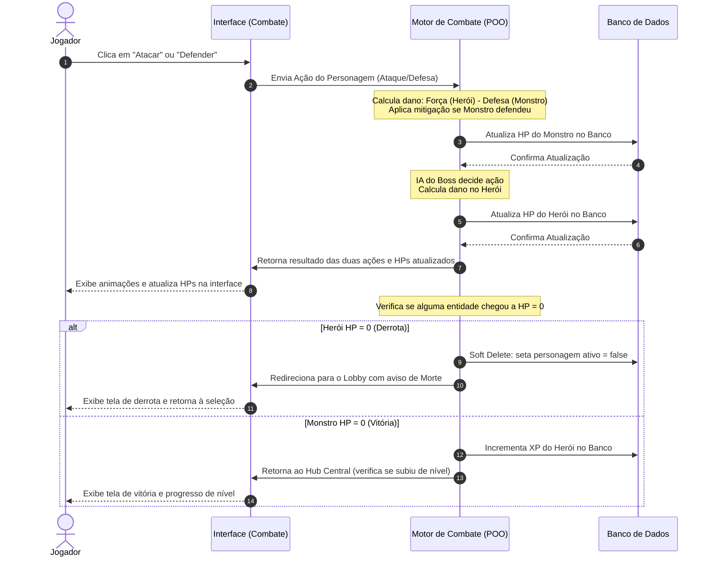

# Sprint 2: Levantamento de Requisitos - Fracture: The Vaslen Echoes

Este documento detalha o levantamento de requisitos funcionais, requisitos não funcionais, regras de negócio e a modelagem do comportamento do sistema para o projeto "Fracture: The Vaslen Echoes". As definições a seguir servem como base para a modelagem orientada a objetos (POO) e implementação do banco de dados relacional.

---

## Perfis de Usuário e Permissões

O sistema possui dois perfis distintos de usuários autenticados para garantir o acesso adequado às funcionalidades:

### 1. Jogador (Player)
Perfil padrão destinado aos usuários que interagem com a jogabilidade e progressão.
*   **Permissões**:
    *   Cadastrar conta e realizar login/logout.
    *   Criar personagens vinculados à sua conta (distribuindo atributos iniciais).
    *   Visualizar e selecionar personagens ativos em seu Lobby.
    *   Inativar manualmente seus personagens (Soft Delete).
    *   Iniciar combates, realizar ações (atacar/defender) no motor de batalha por turnos.
    *   Evoluir personagens distribuindo novos pontos de atributos após subir de nível.
    *   Consultar termos, regras e monstros cadastrados no Códice de Vaslen.

### 2. Administrador (Admin)
Perfil com acesso irrestrito ao painel de controle, manutenção e balanceamento do jogo.
*   **Permissões**:
    *   Todas as permissões do perfil de Jogador.
    *   Gerenciar o Códice de Vaslen (criar, editar e remover termos de lore, guias e monstros).
    *   Cadastrar, configurar e balancear novos monstros/chefes do jogo (HP, Força, Defesa, Agilidade).
    *   Acessar relatórios e logs simples do sistema (ex: total de contas criadas, personagens ativos/deletados).

---

## Requisitos Funcionais (RF)

| Código | Requisito | Descrição |
| :--- | :--- | :--- |
| **RF01** | Cadastro de Contas | O sistema deve permitir que novos usuários criem contas informando e-mail e senha. |
| **RF02** | Autenticação (Login) | O sistema deve permitir a autenticação do usuário e assegurar que rotas internas do jogo exijam uma sessão válida. |
| **RF03** | Criação de Personagens | O sistema deve permitir ao Jogador criar novos personagens escolhendo um nome e uma classe (ex: Guerreiro, Mago, Arqueiro). |
| **RF04** | Validação de Atributos | O sistema deve validar no servidor que a soma dos atributos iniciais (Força, Defesa e Agilidade) seja exatamente igual a 20. |
| **RF05** | Lobby de Seleção | O sistema deve exibir para o Jogador autenticado a lista de seus personagens que estão ativos no banco de dados. |
| **RF06** | Inativação Manual | O sistema deve permitir ao Jogador desativar manualmente qualquer personagem (Soft Delete), removendo-o da listagem do Lobby. |
| **RF07** | Motor de Combate (Turnos) | O sistema deve gerenciar uma batalha sequencial de turnos entre o personagem do jogador e o monstro/chefe selecionado. |
| **RF08** | Ação do Jogador | O sistema deve permitir que o Jogador execute ações no seu turno, como "Atacar" ou "Defender". |
| **RF09** | Processamento do Inimigo | O sistema deve processar a ação automatizada do Chefe (IA do Boss) imediatamente após o encerramento do turno do jogador. |
| **RF10** | Evolução de Nível (XP) | O sistema deve conceder experiência (XP) ao personagem sobrevivente após uma vitória e habilitar a redistribuição/soma de novos atributos no Hub Central. |
| **RF11** | Derrota e Soft Delete | O sistema deve inativar permanentemente no banco de dados (Soft Delete) o personagem cuja vida (HP) for reduzida a zero no combate. |
| **RF12** | Códice de Lore | O sistema deve fornecer uma barra de pesquisa textual com filtros para consulta aos termos de lore, inimigos e mecânicas gravadas no Códice. |
| **RF13** | Painel do Administrador | O sistema deve fornecer uma interface exclusiva para o Administrador cadastrar monstros e modificar dados do Códice de Lore. |

---

## Requisitos Não Funcionais (RNF)

| Código | Requisito | Descrição |
| :--- | :--- | :--- |
| **RNF01** | Responsividade | A interface web do sistema deve ser responsiva, permitindo usabilidade fluida tanto em computadores (desktops) quanto em celulares e tablets. |
| **RNF02** | Segurança de Senhas | O sistema deve armazenar as senhas dos usuários criptografadas no banco de dados utilizando algoritmos hash seguros (como bcrypt). |
| **RNF03** | Tempo de Resposta | O tempo médio de processamento e persistência das ações de combate (ataques, defesas e fim de turno) não deve ultrapassar 500 milissegundos. |
| **RNF04** | Portabilidade de Navegador | O sistema deve ser compatível e renderizar de forma consistente em todos os navegadores modernos (Edge, Chrome, Firefox, Safari). |
| **RNF05** | Persistência de Estado | O sistema deve assegurar a integridade do estado da batalha, registrando o progresso do turno para evitar perdas de dados em caso de desconexão. |

---

## Regras de Negócio (RN)

| Código | Regra | Descrição |
| :--- | :--- | :--- |
| **RN01** | Distribuição Obrigatória de Pontos | A soma dos atributos de criação (`Força + Defesa + Agilidade`) deve totalizar **exatamente 20 pontos** iniciais. Qualquer valor menor ou maior deve ser rejeitado no back-end. |
| **RN02** | Atributos Mínimos | Nenhum atributo de personagem ou monstro (HP, Força, Defesa, Agilidade) poderá conter valor negativo ou igual a zero (com exceção do HP atual durante a batalha). |
| **RN03** | Inativação Automática (Morte) | Quando o HP do personagem chegar a zero durante a batalha, o sistema deve marcar o atributo `ativo` do registro no banco de dados como `false` (Soft Delete). |
| **RN04** | Acesso a Personagens Inativos | Registros de personagens com `ativo = false` não podem ser listados no Lobby de seleção nem ter seu estado alterado de volta para ativo. |
| **RN05** | Fórmula de Dano Mínimo | O dano físico infligido no ataque é calculado como `Dano = Força (Atacante) - Defesa (Defensor)`. Se a Defesa for igual ou superior à Força, o dano mínimo aplicado será sempre de **1 ponto** para evitar combates infinitos. |
| **RN06** | Iniciativa de Turno | A iniciativa do primeiro turno do combate é dada à entidade (herói ou monstro) que possuir o maior atributo de `Agilidade`. Em caso de empate, o jogador tem a preferência. |
| **RN07** | Escalonamento de Experiência (XP) | O limite de experiência para subir de nível é calculado de forma progressiva pela fórmula `XP_Necessário = Nível_Atual * 100`. |
| **RN08** | Restrição de Acesso Administrativo | As rotas de criação de monstros e alteração de termos do Códice de Lore devem ser validadas no back-end, permitindo acesso exclusivo a usuários marcados com perfil `ADMIN`. |
| **RN09** | Confirmação de Level Up | O personagem que subir de nível ficará com status "pendente de evolução", impedindo-o de entrar em novos combates até que o jogador distribua os novos pontos de atributos no Hub Central. |

---

## Descrição Detalhada do Processo Principal

O processo principal de **Fracture: The Vaslen Echoes** consiste no **Ciclo de Combate por Turnos e Suas Consequências**. Este fluxo interage ativamente com os pilares da Orientação a Objetos.

### 🔄 Diagrama de Sequência de Combate

### 🧠 Aplicação de Conceitos de POO

O motor de combate foi projetado com forte fundamentação nos conceitos de Programação Orientada a Objetos:

1.  **Abstração e Herança**:
    *   Tanto os personagens dos jogadores quanto os monstros herdam de uma classe abstrata comum chamada `EntidadeCombatente`. Esta classe base define propriedades essenciais (HP, Força, Defesa, Agilidade, Nome) e comportamentos genéricos de batalha.
    *   Subclasses concretas (como `Guerreiro`, `Mago`, `Arqueiro` para heróis; e `Lich`, `Orc`, `Dragao` para monstros) implementam comportamentos e modificadores de dano ou habilidades especiais particulares de suas classes.
2.  **Identificação de Responsabilidades**:
    *   `EntidadeCombatente`: Responsável por gerenciar seus próprios pontos de vida e verificar se está derrotada.
    *   `CalculadoraDeCombate`: Responsável por receber duas entidades, processar as ações escolhidas e calcular os danos líquidos com base nos atributos, garantindo baixo acoplamento.
    *   `RepositorioPersonagem`: Classe de acesso a dados (DAO/Repository) responsável por abstrair a persistência, executando o salvamento e o Soft Delete no banco de dados.
3.  **Definição dos Comportamentos (Polimorfismo)**:
    *   O método `calcularDanoEspecial()` é polimórfico. Por exemplo, a classe `Mago` calcula seu dano multiplicando atributos com base na classe de magia, enquanto o `Guerreiro` utiliza a força bruta pura. O motor de combate chama o método comum da classe abstrata, e cada subclasse reage de forma específica.
    *   O encapsulamento é mantido rigorosamente: atributos de HP e modificadores não podem ser alterados diretamente de fora da entidade, sendo modificados apenas por métodos controlados como `receberDano(valor)` e `curar(valor)`.
