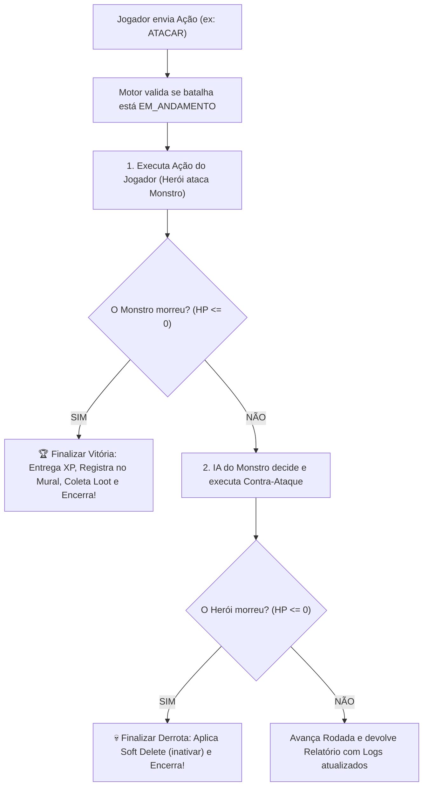

# ⚔️ Guia Prático de Implementação: `MotorCombate.ts`

**Tech Lead:** Antigravity  
**Desenvolvedor:** Gabriel  
**Arquivo a Criar:** `backend/src/dominio/servicos/MotorCombate.ts`  
**Objetivo:** Construir o árbitro oficial das batalhas de Vaslen. Esta classe é uma **Máquina de Estados Stateful** que gerencia o fluxo de turnos, executa ações, valida a morte de combatentes, distribui loots únicos e aplica o Soft Delete.

---

## 🧭 Visão Geral: O Papel do Motor na Arquitetura

O `MotorCombate` **não recalcula fórmulas matemáticas de física** (para isso ele consulta a `CalculadoraCombate`). O trabalho dele é gerenciar a sessão de luta:



---

## 📦 Passo 1: Imports Necessários

No topo do arquivo `MotorCombate.ts`, importe as entidades e o serviço matemático:

```typescript
import { Personagem } from "../entidades/personagem";
import { Monstro } from "../entidades/monstro";
import { Item } from "../entidades/Item";
import { CalculadoraCombate } from "./CalculadoraCombate";
```

---

## 🏷️ Passo 2: Tipos e Interfaces de Entrada e Saída

Crie os contratos de dados que o motor vai receber e devolver. Isso é fundamental para a API da Sprint 4 saber exatamente o que trafegar:

```typescript
// 1. Estados possíveis da batalha
export type EstadoCombate = 'EM_ANDAMENTO' | 'VITORIA_JOGADOR' | 'DERROTA_JOGADOR';

// 2. Tipos de ações que o jogador pode escolher no turno
export type TipoAcaoJogador = 'ATACAR' | 'DEFENDER' | 'HABILIDADE_ESPECIAL' | 'USAR_ITEM';

// 3. O pacote de dados que o jogador envia a cada rodada
export interface ParametrosAcaoJogador {
    tipo: TipoAcaoJogador;
    tipoAtaque?: number;    // 1 (Rápido), 2 (Pesado) ou 3 (Brutal)
    indiceItem?: number;    // Posição do item no array de inventário do herói
}

// 4. O relatório que o Motor devolve após processar a rodada
export interface ResultadoTurno {
    rodada: number;
    estado: EstadoCombate;
    mensagensTurno: string[];
    heroiStatus: {
        nome: string;
        vidaAtual: number;
        vidaMaxima: number;
        energiaAtual: number;
        energiaMaxima: number;
    };
    monstroStatus: {
        nome: string;
        vidaAtual: number;
        vidaMaxima: number;
        energiaAtual: number;
        energiaMaxima: number;
    };
    lootConcedido?: Item;
    experienciaGanha?: number;
}
```

---

## 🏛️ Passo 3: Atributos Privados e Construtor

A classe precisa guardar o estado da sessão viva na memória:

```typescript
export class MotorCombate {
    private heroi: Personagem;
    private monstro: Monstro;
    private rodadaAtual: number;
    private estado: EstadoCombate;
    private logsBatalha: string[];

    constructor(heroi: Personagem, monstro: Monstro) {
        this.heroi = heroi;
        this.monstro = monstro;
        this.rodadaAtual = 1;
        this.estado = 'EM_ANDAMENTO';
        this.logsBatalha = [];
    }
```

---

## 🎬 Passo 4: O Método `iniciarCombate()`

Este método prepara a arena antes da primeira rodada:

### O que ele deve fazer:
1. **Validação do Herói:** Checar se o herói está vivo e ativo (`if (!this.heroi.ativo)`). Se estiver inativo, lançar erro: `"Herói inativo não pode entrar em combate."`.
2. **Validação do Mural de Caçadas Únicas:** Checar se o monstro já foi caçado pelo herói (`if (this.heroi.jaDerrotouMonstro(this.monstro.getId()))`). Se já foi caçado, lançar erro: `"Este monstro já foi expurgado de Vaslen."`.
3. **Iniciativa (Quem joga primeiro):**
   * Rola a iniciativa usando a calculadora:  
     `const inicHeroi = CalculadoraCombate.rolarIniciativa(this.heroi.getAgilidade());`  
     `const inicMonstro = CalculadoraCombate.rolarIniciativa(this.monstro.getAgilidade());`
   * Grava mensagem nos logs avisando quem começou.
4. **Retorna:** Um objeto simples informando `{ primeiroAJogar: string, mensagem: string }`.

---

## ⚙️ Passo 5: O Método Principal `processarTurno(acao)`

Este é o método mais importante da sua jornada! Ele processa o turno do jogador e o contra-ataque do monstro.

```typescript
public processarTurno(acao: ParametrosAcaoJogador): ResultadoTurno {
```

### Passo a passo da lógica dentro dele:

#### 1. Validar se o combate ainda está rolando
Se `this.estado !== 'EM_ANDAMENTO'`, lance um erro: `"O combate já foi encerrado com estado: " + this.estado`.

#### 2. Criar uma lista local de mensagens da rodada
`const mensagensDestaRodada: string[] = [];`

#### 3. Executar a ação escolhida pelo Herói
* **Se `acao.tipo === 'ATACAR'`:**
  * Pega `const tipo = acao.tipoAtaque ?? 1;`
  * Executa `const msgAtaque = this.heroi.ataque(this.monstro, tipo);`
  * Adiciona `msgAtaque` nas mensagens.
* **Se `acao.tipo === 'DEFENDER'`:**
  * Executa `this.heroi.defender();`
  * Adiciona a mensagem: `"${this.heroi.getNome()} assumiu postura defensiva (+15 Energia e mitigação de dano)."`
* **Se `acao.tipo === 'HABILIDADE_ESPECIAL'`:**
  * Executa `const msgEsp = this.heroi.executarAcaoEspecial(this.monstro);`
  * Adiciona `msgEsp` nas mensagens.
* **Se `acao.tipo === 'USAR_ITEM'`:**
  * Pega o índice: `const idx = acao.indiceItem ?? 0;`
  * Executa `const msgItem = this.heroi.usarItemDoInventario(idx, this.heroi);`
  * Adiciona `msgItem` nas mensagens.

---

### ⚠️ A GRANDE ARMADILHA: Checagem de Morte do Monstro!
Logo após o ataque do herói, você **DEVE** checar:
```typescript
if (this.monstro.estaDerrotado()) {
    // 1. Invoca o método privado de vitória
    const dadosVitoria = this.finalizarVitoria(mensagensDestaRodada);
    
    // 2. RETORNA IMEDIATAMENTE! O monstro está morto, ele NÃO PODE contra-atacar!
    return this.gerarRelatorioTurno(mensagensDestaRodada, dadosVitoria.loot, dadosVitoria.xp);
}
```

---

#### 4. O Contra-Ataque do Monstro (Se ele sobreviveu)
* Invoca a IA autônoma da fera:  
  `const acaoMonstro = this.monstro.decidirAcao(this.heroi);`
* Adiciona `acaoMonstro.mensagem` nas mensagens da rodada.

---

### ⚠️ Segunda Checagem: O Herói Morreu?
Logo após o golpe do monstro, checa:
```typescript
if (this.heroi.estaDerrotado()) {
    // Invoca o método privado de derrota (Soft Delete)
    this.finalizarDerrota(mensagensDestaRodada);
    
    return this.gerarRelatorioTurno(mensagensDestaRodada);
}
```

---

#### 5. Se os dois continuam de pé:
* Incrementa `this.rodadaAtual++;`
* Retorna `return this.gerarRelatorioTurno(mensagensDestaRodada);`

---

## 🏆 Passo 6: Métodos Privados Auxiliares

Isole essas ações em métodos privados para deixar o código elegante e limpo:

### 1. `finalizarVitoria(logs: string[])`
* Altera `this.estado = 'VITORIA_JOGADOR';`
* **Registra o monstro no mural:** `this.heroi.registrarVitoriaContraMonstro(this.monstro.getId());`
* **Entrega o XP:** `const xp = this.monstro.getExperienciaConcedida();` ➔ `this.heroi.ganharExperiencia(xp);`
* **Coleta e Entrega o Loot:**
  ```typescript
  const loot = this.monstro.droparLoot();
  if (loot) {
      this.heroi.adicionarItemAoInventario(loot);
      logs.push(`🎁 [SISTEMA DE LOOT] Você saqueou: ${loot.getNome()}!`);
  }
  ```
* Adiciona mensagem de comemoração e retorna `{ loot, xp }`.

### 2. `finalizarDerrota(logs: string[])`
* Altera `this.estado = 'DERROTA_JOGADOR';`
* **Aciona o Soft Delete:** `this.heroi.inativar();`
* Adiciona mensagem fúnebre: `logs.push("☠️ ${this.heroi.getNome()} sucumbiu em batalha. (Soft Delete aplicado).");`

### 3. `gerarRelatorioTurno(...)`
Monta o objeto `ResultadoTurno` pegando `this.heroi.getVidaAtual()`, `this.heroi.getEnergiaAtual()`, etc.

---

## 🔍 Passo 7: Getters de Consulta

Adicione getters para permitir que o servidor web inspecione o estado a qualquer momento:
* `getHeroi(): Personagem`
* `getMonstro(): Monstro`
* `getEstado(): EstadoCombate`
* `getRodadaAtual(): number`
* `getLogsBatalha(): string[]`

---

## 🎯 Checklist de Auto-Verificação para Você:
- [ ] O construtor inicializou `rodadaAtual = 1` e `estado = 'EM_ANDAMENTO'`?
- [ ] O método `iniciarCombate()` bloqueou heróis inativos e monstros já caçados?
- [ ] Se o monstro morrer no turno do herói, o motor dá `return` imediatamente sem deixar o monstro bater?
- [ ] Na vitória, o herói ganhou XP, salvou o monstro no mural e colocou o loot no inventário?
- [ ] Na derrota, o método `heroi.inativar()` foi executado com sucesso?

---

Com esse guia, você tem o mapa completo do tesouro! Pode abrir o arquivo `backend/src/dominio/servicos/MotorCombate.ts` e começar a codar com total tranquilidade. Qualquer dúvida em qualquer linha, me chama! 🚀
